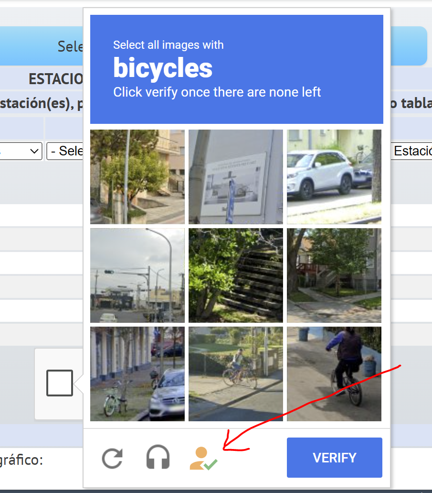
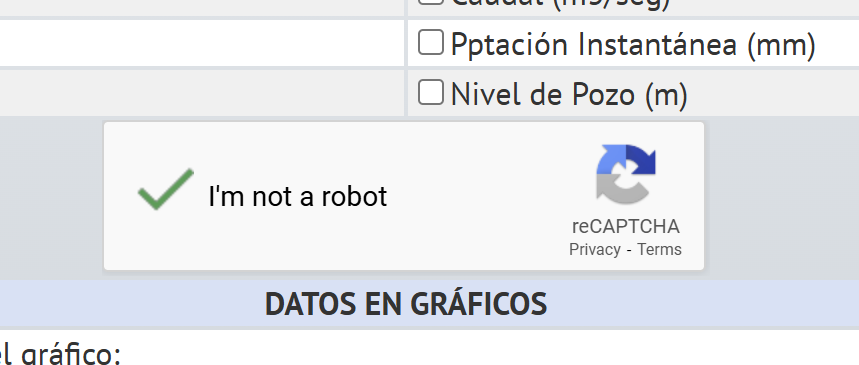
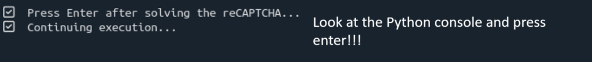

# download-DGA
Python script using Selenium to scrape and download meteorological data from the DGA (Dirección General de Aguas, Chile) website.

 
This repository contains the necessary files and instructions to set up an environment for using the Selenium. Follow the steps below to get started.

## Cloning the Repository
 
To clone this repository, open your terminal and run the following command:


```bash
git clone git@github.com:SNOWCOP/download-DGA.git
 
cd download-DGA/
 
conda env create -f download_dga.yml
 
conda activate download-DGA
 
spyder
```

Alternatively, you can create your own Conda environment and install the necessary libraries—such as Selenium and Pandas—using Conda. Add any additional dependencies as needed for your setup.


## 🛠 Seeting up the Code
Before running the script `download.py`, scroll down to the **configuration section** and set the following parameters:

- **`parameter` (L210) **  
  The meteorological parameter you want to download (among `"temperature"`, `"snow_height"`, `"SWE"`, `"precipitation"`,`"discharge"` and `"radiation"`).  

- **`download_name` (L215) **  
  Full path to the expected download file name (usually where Chrome saves files by default).  
  **Example on Windows:**

  ```python
  download_name = "C:/Users/your_username/Downloads/download.xls"
  ```

- **`outdir` (L220) **  
  Directory path where you want the output files to be saved.
Make sure this directory exists or is created before saving. +
Already existing files will not be overwritten!

- **`ids_list` (L224) **  
 A Python list containing the station IDs (as strings) you wish to download data for.

- **`date_list` (L226) **  
  This variable is automatically loaded from a text file (`date_list.txt`) and contains the list of date ranges used for data downloads.

  When working with **daily resolution**, the total date range is divided into smaller chunks of approximately **330 days**, which is the **maximum period allowed per request** by the DGA website.

### ▶️ Running the Script

Once you have modified the configuration parameters, you can run the script.

If everything is working correctly, a **CAPTCHA** will appear after a short delay. On **Windows**, this is signaled by a **notification sound**.

> **Note:** You do **not** need to solve the CAPTCHA. Simply **click on the orange icon** to continue the process.

<p align="center">
  
</p>

Do this as many times as needed until the CAPTCHA is cleared, also eventually by refreshing the CAPTCHA and by changing between an audio or visual CAPTCHA. Before proceeding with the script, the CAPTCHA must be verified succesfully:

<p align="center">
  
</p>

Now you need to press ENTER in your Python console and the script will continue!

<p align="center">
  
</p>

In the unfortunate case the website crashes or something went wrong, restart the script.


